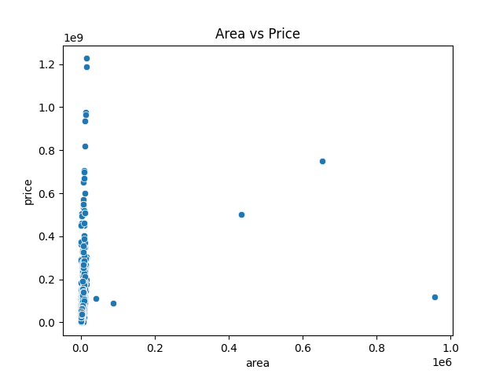

# Gurgaon Real Estate Market Analysis

## Overview

This project focuses on analyzing real estate data from Gurgaon (Gurugram) to uncover pricing trends, locality insights, and factors affecting property valuation. The analysis is performed using Python with data cleaning, transformation, and visualization techniques.

---

## Objectives

* Identify the costliest property in the dataset
* Analyze price trends across different localities
* Compare ready-to-move vs under-construction properties
* Evaluate the impact of RERA approval on pricing
* Study how area and BHK count affect property prices

---

## Tools & Technologies

* Python
* Pandas
* Matplotlib
* Seaborn

---

## Data Cleaning Steps

* Removed duplicate records
* Standardized column names (lowercase, underscores)
* Converted numerical columns (price, area, rate per sqft) to proper formats
* Cleaned categorical values (status, flat type, RERA approval)

---

## Key Analysis & Insights

### 1. Costliest Property

Identified the most expensive property along with details such as locality, builder, area, and BHK count.

### 2. Locality-wise Pricing

* Found the locality with the highest average property price
* Identified top 10 most expensive localities

### 3. Rate per Square Foot

Analyzed which locality has the highest average price per square foot.

### 4. Property Status Comparison

Compared average prices of:

* Ready-to-move properties
* Under-construction properties

### 5. RERA Impact

Studied whether RERA-approved properties command higher prices.

### 6. Area vs Price Relationship

Used scatter plots to visualize how property area affects price.

### 7. BHK Analysis

Determined which BHK category has the highest price per square foot.

### 8. Property Type Comparison

Identified the most expensive property type on average.

### 9. Builder-wise Pricing

Analyzed which builders tend to price their properties higher.

### 10. Area vs Rate per Sqft

Explored whether larger homes are more expensive per square foot.

---

## Visualizations




---

## How to Run the Project

1. Clone the repository
2. Install required libraries:

   ```bash
   pip install pandas matplotlib seaborn
   ```
3. Run the Python script:

   ```bash
   python gurgaon_real_estate_analysis.py
   ```

---

## Conclusion

This project highlights key real estate trends in Gurgaon using data analysis techniques. It demonstrates skills in data cleaning, exploratory data analysis, and visualization using real-world data.

---

## Future Improvements

* Add interactive dashboards (Power BI / Tableau)
* Perform predictive analysis using machine learning
* Include more datasets for deeper insights
